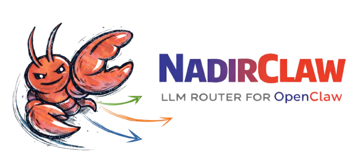

# NadirClaw



Open-source LLM router that saves you money. Simple prompts go to cheap/local models, complex prompts go to premium models -- automatically.

NadirClaw sits between your AI tool and your LLM providers as an OpenAI-compatible proxy. It classifies every prompt in ~10ms and routes it to the right model. Works with any tool that speaks the OpenAI API: [OpenClaw](https://openclaw.dev), [Codex](https://github.com/openai/codex), Claude Code, Continue, Cursor, or plain `curl`.

```
Your AI Tool ──> NadirClaw (:8856/v1) ──> simple prompts  ──> Gemini Flash / Ollama (free/cheap)
                                      ──> complex prompts ──> Gemini Pro / GPT / Claude (premium)
```

## Quick Start

```bash
curl -fsSL https://raw.githubusercontent.com/doramirdor/NadirClaw/main/install.sh | sh
```

Then start the router:

```bash
nadirclaw serve --verbose
```

That's it. NadirClaw starts on `http://localhost:8856` with sensible defaults (Gemini 3 Flash for simple, OpenAI Codex for complex).

## Features

- **Smart routing** — classifies prompts in ~10ms using sentence embeddings
- **Rate limit fallback** — if the primary model is rate-limited (429), automatically falls back to the other tier's model instead of failing
- **Streaming support** — full SSE streaming compatible with OpenClaw, Codex, and other streaming clients
- **Native Gemini support** — calls Gemini models directly via the Google GenAI SDK (not through LiteLLM)
- **OAuth login** — use your subscription with `nadirclaw auth <provider> login` (OpenAI, Anthropic, Google), no API key needed
- **Multi-provider** — supports Gemini, OpenAI, Anthropic, Ollama, and any LiteLLM-supported provider
- **OpenAI-compatible API** — drop-in replacement for any tool that speaks the OpenAI chat completions API
- **Request reporting** — `nadirclaw report` analyzes your JSONL logs with filters, latency stats, tier breakdown, and token usage
- **Raw logging** — optional `--log-raw` flag to capture full request/response content for debugging and replay
- **OpenTelemetry tracing** — optional distributed tracing with GenAI semantic conventions (`pip install nadirclaw[telemetry]`)

## Prerequisites

- **Python 3.10+**
- **git**
- **At least one LLM provider:**
  - [Google Gemini API key](https://aistudio.google.com/apikey) (free tier: 20 req/day)
  - [Ollama](https://ollama.com) running locally (free, no API key needed)
  - [Anthropic API key](https://console.anthropic.com/) for Claude models
  - [OpenAI API key](https://platform.openai.com/) for GPT models
  - Provider subscriptions via OAuth (`nadirclaw auth openai login`, `nadirclaw auth anthropic login`, `nadirclaw auth antigravity login`, `nadirclaw auth gemini login`)
  - Or any provider supported by [LiteLLM](https://docs.litellm.ai/docs/providers)

## Install

### One-line install (recommended)

```bash
curl -fsSL https://raw.githubusercontent.com/doramirdor/NadirClaw/main/install.sh | sh
```

This clones the repo to `~/.nadirclaw`, creates a virtual environment, installs dependencies, and adds `nadirclaw` to your PATH. Run it again to update.

### Manual install

```bash
git clone https://github.com/doramirdor/NadirClaw.git
cd NadirClaw
python3 -m venv venv
source venv/bin/activate
pip install -e .
```

### Uninstall

```bash
rm -rf ~/.nadirclaw
sudo rm -f /usr/local/bin/nadirclaw
```

## Configure

### Environment File

NadirClaw loads configuration from `~/.nadirclaw/.env`. Create or edit this file to set API keys and model preferences:

```bash
# ~/.nadirclaw/.env

# API keys (set the ones you use)
GEMINI_API_KEY=AIza...
OPENAI_API_KEY=sk-...
ANTHROPIC_API_KEY=sk-ant-...

# Model routing
NADIRCLAW_SIMPLE_MODEL=gemini-3-flash-preview
NADIRCLAW_COMPLEX_MODEL=gemini-2.5-pro

# Server
NADIRCLAW_PORT=8856
```

If `~/.nadirclaw/.env` does not exist, NadirClaw falls back to `.env` in the current directory.

### Authentication

NadirClaw supports multiple ways to provide LLM credentials, checked in this order:

1. **OpenClaw stored token** (`~/.openclaw/agents/main/agent/auth-profiles.json`)
2. **NadirClaw stored credential** (`~/.nadirclaw/credentials.json`)
3. **Environment variable** (`GEMINI_API_KEY`, `ANTHROPIC_API_KEY`, `OPENAI_API_KEY`, etc.)

#### Using `nadirclaw auth` (recommended)

```bash
# Add a Gemini API key
nadirclaw auth add --provider google --key AIza...

# Add any provider API key
nadirclaw auth add --provider anthropic --key sk-ant-...
nadirclaw auth add --provider openai --key sk-...

# Login with your OpenAI/ChatGPT subscription (OAuth, no API key needed)
nadirclaw auth openai login

# Login with your Anthropic/Claude subscription (OAuth, no API key needed)
nadirclaw auth anthropic login

# Login with Google Gemini (OAuth, opens browser)
nadirclaw auth gemini login

# Login with Google Antigravity (OAuth, opens browser)
nadirclaw auth antigravity login

# Store a Claude subscription token (from 'claude setup-token') - alternative to OAuth
nadirclaw auth setup-token

# Check what's configured
nadirclaw auth status

# Remove a credential
nadirclaw auth remove google
```

#### Using environment variables

Set API keys in `~/.nadirclaw/.env`:

```bash
GEMINI_API_KEY=AIza...          # or GOOGLE_API_KEY
ANTHROPIC_API_KEY=sk-ant-...
OPENAI_API_KEY=sk-...
```

### Model Configuration

The two key settings are which model handles each tier:

```bash
NADIRCLAW_SIMPLE_MODEL=gemini-3-flash-preview          # cheap/free model
NADIRCLAW_COMPLEX_MODEL=gemini-2.5-pro                 # premium model
```

### Example Setups

| Setup | Simple Model | Complex Model | API Keys Needed |
|---|---|---|---|
| **Gemini + Gemini** | `gemini-3-flash-preview` | `gemini-2.5-pro` | `GEMINI_API_KEY` |
| **Gemini + Claude** | `gemini-3-flash-preview` | `claude-sonnet-4-20250514` | `GEMINI_API_KEY` + `ANTHROPIC_API_KEY` |
| **Claude + Ollama** | `ollama/llama3.1:8b` | `claude-sonnet-4-20250514` | `ANTHROPIC_API_KEY` |
| **Claude + Claude** | `claude-haiku-4-20250514` | `claude-sonnet-4-20250514` | `ANTHROPIC_API_KEY` |
| **OpenAI + Ollama** | `ollama/llama3.1:8b` | `gpt-4o` | `OPENAI_API_KEY` |
| **OpenAI + OpenAI** | `gpt-4o-mini` | `gpt-4o` | `OPENAI_API_KEY` |
| **OpenAI Codex** | `gemini-3-flash-preview` | `openai-codex/gpt-5.3-codex` | `GEMINI_API_KEY` + OAuth login |
| **Fully local** | `ollama/llama3.1:8b` | `ollama/qwen3:32b` | None |

Gemini models are called natively via the Google GenAI SDK. All other models go through [LiteLLM](https://docs.litellm.ai/docs/providers), which supports 100+ providers.

## Usage with Gemini

Gemini is the default simple model. NadirClaw calls Gemini natively via the Google GenAI SDK for best performance.

```bash
# Set your Gemini API key
nadirclaw auth add --provider google --key AIza...

# Or set in ~/.nadirclaw/.env
echo "GEMINI_API_KEY=AIza..." >> ~/.nadirclaw/.env

# Start the router
nadirclaw serve --verbose
```

### Rate Limit Fallback

If the primary model hits a 429 rate limit, NadirClaw automatically retries once, then falls back to the other tier's model. For example, if `gemini-3-flash-preview` is exhausted, NadirClaw will try `gemini-2.5-pro` (or whatever your complex model is). If both models are rate-limited, it returns a friendly error message instead of crashing.

## Usage with Ollama

If you're running [Ollama](https://ollama.com) locally, NadirClaw works out of the box with no API keys:

```bash
# Fully local setup -- no API keys, no cost
NADIRCLAW_SIMPLE_MODEL=ollama/llama3.1:8b \
NADIRCLAW_COMPLEX_MODEL=ollama/qwen3:32b \
nadirclaw serve --verbose
```

Or mix local + cloud:

```bash
nadirclaw serve \
  --simple-model ollama/llama3.1:8b \
  --complex-model claude-sonnet-4-20250514 \
  --verbose
```

### Recommended Ollama Models

| Model | Size | Good For |
|---|---|---|
| `llama3.1:8b` | 4.7 GB | Simple tier (fast, good enough) |
| `qwen3:32b` | 19 GB | Complex tier (local, no API cost) |
| `qwen3-coder` | 19 GB | Code-heavy complex tier |
| `deepseek-r1:14b` | 9 GB | Reasoning-heavy complex tier |

## Usage with OpenClaw

[OpenClaw](https://openclaw.dev) is a personal AI assistant that bridges messaging services to AI coding agents. NadirClaw integrates as a model provider so OpenClaw's requests are automatically routed to the right model.

### Quick Setup

```bash
# Auto-configure OpenClaw to use NadirClaw
nadirclaw openclaw onboard

# Start the router
nadirclaw serve
```

This writes NadirClaw as a provider in `~/.openclaw/openclaw.json` with model `nadirclaw/auto`. If OpenClaw is already running, it will auto-reload the config -- no restart needed.

### Configure Only (Without Launching)

```bash
nadirclaw openclaw onboard
# Then start NadirClaw separately when ready:
nadirclaw serve
```

### What It Does

`nadirclaw openclaw onboard` adds this to your OpenClaw config:

```json
{
  "models": {
    "providers": {
      "nadirclaw": {
        "baseUrl": "http://localhost:8856/v1",
        "apiKey": "local",
        "api": "openai-completions",
        "models": [{ "id": "auto", "name": "auto" }]
      }
    }
  },
  "agents": {
    "defaults": {
      "model": { "primary": "nadirclaw/auto" }
    }
  }
}
```

NadirClaw supports the SSE streaming format that OpenClaw expects (`stream: true`), handling multi-modal content and tool definitions in system prompts.

## Usage with Codex

[Codex](https://github.com/openai/codex) is OpenAI's CLI coding agent. NadirClaw integrates as a custom model provider.

```bash
# Auto-configure Codex
nadirclaw codex onboard

# Start the router
nadirclaw serve
```

This writes `~/.codex/config.toml`:

```toml
model_provider = "nadirclaw"

[model_providers.nadirclaw]
base_url = "http://localhost:8856/v1"
api_key = "local"
```

### OpenAI Subscription (OAuth)

To use your ChatGPT subscription instead of an API key:

```bash
# Login with your OpenAI account (opens browser)
nadirclaw auth openai login

# NadirClaw will auto-refresh the token when it expires
```

This delegates to the Codex CLI for the OAuth flow and stores the credentials in `~/.nadirclaw/credentials.json`. Tokens are automatically refreshed when they expire.

## Usage with Any OpenAI-Compatible Tool

NadirClaw exposes a standard OpenAI-compatible API. Point any tool at it:

```bash
# Base URL
http://localhost:8856/v1

# Model
model: "auto"    # or omit -- NadirClaw picks the best model
```

### Example: curl

```bash
curl http://localhost:8856/v1/chat/completions \
  -H "Content-Type: application/json" \
  -d '{
    "messages": [{"role": "user", "content": "What is 2+2?"}]
  }'
```

### Example: curl (streaming)

```bash
curl http://localhost:8856/v1/chat/completions \
  -H "Content-Type: application/json" \
  -d '{
    "messages": [{"role": "user", "content": "What is 2+2?"}],
    "stream": true
  }'
```

### Example: Python (openai SDK)

```python
from openai import OpenAI

client = OpenAI(
    base_url="http://localhost:8856/v1",
    api_key="local",  # NadirClaw doesn't require auth by default
)

response = client.chat.completions.create(
    model="auto",
    messages=[{"role": "user", "content": "What is 2+2?"}],
)
print(response.choices[0].message.content)
```

## CLI Reference

```bash
nadirclaw serve              # Start the router server
nadirclaw serve --log-raw    # Start with full request/response logging
nadirclaw classify           # Classify a prompt (no server needed)
nadirclaw report             # Show a summary report of request logs
nadirclaw report --since 24h # Report for the last 24 hours
nadirclaw status             # Show config, credentials, and server status
nadirclaw auth add           # Add an API key for any provider
nadirclaw auth status        # Show configured credentials (masked)
nadirclaw auth remove        # Remove a stored credential
nadirclaw auth setup-token      # Store a Claude subscription token (alternative to OAuth)
nadirclaw auth openai login     # Login with OpenAI subscription (OAuth)
nadirclaw auth openai logout    # Remove stored OpenAI OAuth credential
nadirclaw auth anthropic login     # Login with Anthropic/Claude subscription (OAuth)
nadirclaw auth anthropic logout    # Remove stored Anthropic OAuth credential
nadirclaw auth antigravity login   # Login with Google Antigravity (OAuth, opens browser)
nadirclaw auth antigravity logout  # Remove stored Antigravity OAuth credential
nadirclaw auth gemini login       # Login with Google Gemini (OAuth, opens browser)
nadirclaw auth gemini logout      # Remove stored Gemini OAuth credential
nadirclaw codex onboard         # Configure Codex integration
nadirclaw openclaw onboard   # Configure OpenClaw integration
nadirclaw build-centroids    # Regenerate centroid vectors from prototypes
```

### `nadirclaw serve`

```bash
nadirclaw serve [OPTIONS]

Options:
  --port INTEGER          Port to listen on (default: 8856)
  --simple-model TEXT     Model for simple prompts
  --complex-model TEXT    Model for complex prompts
  --models TEXT           Comma-separated model list (legacy)
  --token TEXT            Auth token
  --verbose               Enable debug logging
  --log-raw               Log full raw requests and responses to JSONL
```

### `nadirclaw report`

Analyze request logs and print a summary report:

```bash
nadirclaw report                     # full report
nadirclaw report --since 24h         # last 24 hours
nadirclaw report --since 7d          # last 7 days
nadirclaw report --since 2025-02-01  # since a specific date
nadirclaw report --model gemini      # filter by model name
nadirclaw report --format json       # machine-readable JSON output
nadirclaw report --export report.txt # save to file
```

Example output:

```
NadirClaw Report
==================================================
Total requests: 147
From: 2026-02-14T08:12:03+00:00
To:   2026-02-14T22:47:19+00:00

Requests by Type
------------------------------
  classify                    12
  completion                 135

Tier Distribution
------------------------------
  complex                    41  (31.1%)
  direct                      8  (6.1%)
  simple                     83  (62.9%)

Model Usage
------------------------------------------------------------
  Model                               Reqs      Tokens
  gemini-3-flash-preview                83       48210
  openai-codex/gpt-5.3-codex           41      127840
  claude-sonnet-4-20250514               8       31500

Latency (ms)
----------------------------------------
  classifier       avg=12  p50=11  p95=24
  total             avg=847  p50=620  p95=2340

Token Usage
------------------------------
  Prompt:         138420
  Completion:      69130
  Total:          207550

  Fallbacks: 3
  Errors: 2
  Streaming requests: 47
  Requests with tools: 18 (54 tools total)
```

### `nadirclaw classify`

Classify a prompt locally without running the server. Useful for testing your setup:

```bash
$ nadirclaw classify "What is 2+2?"
Tier:       simple
Confidence: 0.2848
Score:      0.0000
Model:      gemini-3-flash-preview

$ nadirclaw classify "Design a distributed system for real-time trading"
Tier:       complex
Confidence: 0.1843
Score:      1.0000
Model:      gemini-2.5-pro
```

### `nadirclaw status`

```bash
$ nadirclaw status
NadirClaw Status
----------------------------------------
Simple model:  gemini-3-flash-preview
Complex model: gemini-2.5-pro
Tier config:   explicit (env vars)
Port:          8856
Threshold:     0.06
Log dir:       /Users/you/.nadirclaw/logs
Token:         nadir-***

Server:        RUNNING (ok)
```

## How It Works

NadirClaw uses a binary complexity classifier based on sentence embeddings:

1. **Pre-computed centroids**: Ships two tiny centroid vectors (~1.5 KB each) derived from ~170 seed prompts. These are pre-computed and included in the package — no training step required.

2. **Classification**: For each incoming prompt, computes its embedding using [all-MiniLM-L6-v2](https://huggingface.co/sentence-transformers/all-MiniLM-L6-v2) (~80 MB, downloaded once on first use) and measures cosine similarity to both centroids. If the prompt is closer to the complex centroid, it routes to your complex model; otherwise to your simple model.

3. **Borderline handling**: When confidence is below the threshold (default 0.06), the classifier defaults to complex -- it's cheaper to over-serve a simple prompt than to under-serve a complex one.

4. **Routing**: Calls the selected model via the appropriate backend:
   - **Gemini models** — called natively via the [Google GenAI SDK](https://github.com/googleapis/python-genai) for best performance
   - **All other models** — called via [LiteLLM](https://docs.litellm.ai), which provides a unified interface to 100+ providers

5. **Rate limit fallback**: If the selected model returns a 429 rate limit error, NadirClaw retries once, then automatically falls back to the other tier's model. If both are rate-limited, it returns a user-friendly error message.

Classification takes ~10ms on a warm encoder. The first request takes ~2-3 seconds to load the embedding model.

## API Endpoints

Auth is disabled by default (local-only). Set `NADIRCLAW_AUTH_TOKEN` to require a bearer token.

| Endpoint | Method | Description |
|---|---|---|
| `/v1/chat/completions` | POST | OpenAI-compatible completions with auto routing (supports `stream: true`) |
| `/v1/classify` | POST | Classify a prompt without calling an LLM |
| `/v1/classify/batch` | POST | Classify multiple prompts at once |
| `/v1/models` | GET | List available models |
| `/v1/logs` | GET | View recent request logs |
| `/health` | GET | Health check (no auth required) |

## Configuration Reference

| Variable | Default | Description |
|---|---|---|
| `NADIRCLAW_SIMPLE_MODEL` | `gemini-3-flash-preview` | Model for simple prompts |
| `NADIRCLAW_COMPLEX_MODEL` | `openai-codex/gpt-5.3-codex` | Model for complex prompts |
| `NADIRCLAW_AUTH_TOKEN` | *(empty — auth disabled)* | Set to require a bearer token |
| `GEMINI_API_KEY` | -- | Google Gemini API key (also accepts `GOOGLE_API_KEY`) |
| `ANTHROPIC_API_KEY` | -- | Anthropic API key |
| `OPENAI_API_KEY` | -- | OpenAI API key |
| `OLLAMA_API_BASE` | `http://localhost:11434` | Ollama base URL |
| `NADIRCLAW_CONFIDENCE_THRESHOLD` | `0.06` | Classification threshold (lower = more complex) |
| `NADIRCLAW_PORT` | `8856` | Server port |
| `NADIRCLAW_LOG_DIR` | `~/.nadirclaw/logs` | Log directory |
| `NADIRCLAW_LOG_RAW` | `false` | Log full raw requests and responses (`true`/`false`) |
| `NADIRCLAW_MODELS` | `openai-codex/gpt-5.3-codex,gemini-3-flash-preview` | Legacy model list (fallback if tier vars not set) |
| `OTEL_EXPORTER_OTLP_ENDPOINT` | *(empty — disabled)* | OpenTelemetry collector endpoint (enables tracing) |

## OpenTelemetry (Optional)

NadirClaw supports optional distributed tracing via OpenTelemetry. Install the extras and set an OTLP endpoint:

```bash
pip install nadirclaw[telemetry]

# Export to a local collector (e.g. Jaeger, Grafana Tempo)
OTEL_EXPORTER_OTLP_ENDPOINT=http://localhost:4317 nadirclaw serve
```

When enabled, NadirClaw emits spans for:
- **`smart_route_analysis`** — classifier decision with tier and selected model
- **`dispatch_model`** — individual LLM provider call
- **`chat_completion`** — full request lifecycle

Spans include [GenAI semantic conventions](https://opentelemetry.io/docs/specs/semconv/gen-ai/) (`gen_ai.request.model`, `gen_ai.usage.input_tokens`, `gen_ai.usage.output_tokens`) plus custom `nadirclaw.*` attributes for routing metadata.

If the telemetry packages are not installed or `OTEL_EXPORTER_OTLP_ENDPOINT` is not set, all tracing is a no-op with zero overhead.

## Project Structure

```
nadirclaw/
  __init__.py        # Package version
  cli.py             # CLI commands (serve, classify, report, status, auth, codex, openclaw)
  server.py          # FastAPI server with OpenAI-compatible API + streaming
  classifier.py      # Binary complexity classifier (sentence embeddings)
  credentials.py     # Credential storage, resolution chain, and OAuth token refresh
  encoder.py         # Shared SentenceTransformer singleton
  oauth.py           # OAuth login flows (OpenAI, Anthropic, Gemini, Antigravity)
  report.py          # Log parsing and report generation
  telemetry.py       # Optional OpenTelemetry integration (no-op without packages)
  auth.py            # Bearer token / API key authentication
  settings.py        # Environment-based configuration (reads ~/.nadirclaw/.env)
  prototypes.py      # Seed prompts for centroid generation
  simple_centroid.npy   # Pre-computed simple centroid vector
  complex_centroid.npy  # Pre-computed complex centroid vector
```

## License

MIT
